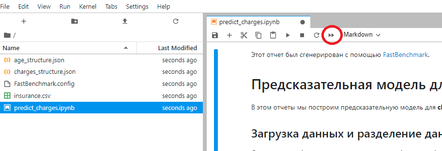
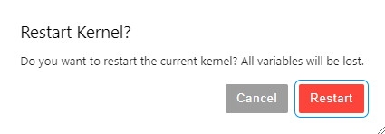

# Для кого это?
Если ты юный датасаентист, который еще не умеет писать километровые скрипты в python за 300к в наносек, но очень
хочешь побаловаться с предсказательными моделями - это то, что тебе нужно.  

Если ты старый и опытный специалист по статистике и анализу данных, но ни разу не программист и хочешь понять
что такое этот ваш машин лёрнинг - и тебе тоже это пригодится.  

Всё просто:  
1. Ставишь себе питон последней версии отсюда: https://www.python.org/downloads/
2. Устанавливаешь все необходимые библиотеки
3. Берешь свои данные в формате csv, определяешь, для какой переменной из этих данных ты хочешь построить 
предсказательную модель.
4. Пихаешь этот набор данных в приложение, указываешь переменную, целевую метрику и если надо убирашь лишние переменные
5. Получаешь отчётик с инфой про твои прекрасные данные и про то, что там и как на их основе можно предсказывать

## Как установить необходимые библиотеки?
В проекте есть requirements.txt, так что просто натравливаешь на него своё cmd и пишешь там в консоли:

```
python -m pip install -r requirements.txt --user
```

## Всё поставил и запустил, открылась какая-то шляпа в браузере. Что делать то?
Теперь все элементарно.
Жми вот на эту кнопочку:  
  


А потом на большую красную кнопку Restart:



Дальше подожди пока все посчитается и читай отчет, генерируй новые переменные, подстраивай модели, развлекайся.